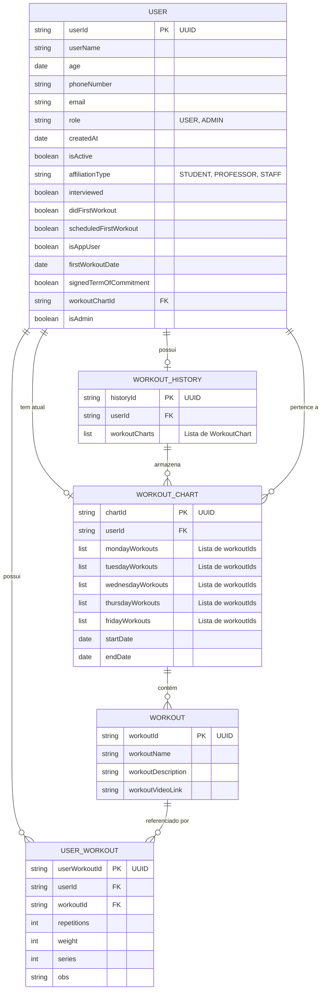

# Modelo Entidade-Relacionamento - MovimentaIF

## Diagrama ER

## Descrição das Entidades

### 👤 USER (Usuário)
Representa os usuários do sistema (alunos, professores e administradores).

**Atributos principais:**
- `userId`: Identificador único (UUID)
- `userName`: Nome completo do usuário
- `email`: E-mail para login
- `role`: Papel no sistema (USER, ADMIN)
- `affiliationType`: Tipo de vínculo (STUDENT, PROFESSOR, STAFF)
- `isActive`: Status ativo/inativo
- `interviewed`: Se passou por entrevista inicial
- `didFirstWorkout`: Se já realizou primeiro treino
- `workoutChartId`: Referência à ficha de treino atual

### 💪 WORKOUT (Exercício)
Catálogo de exercícios disponíveis na academia.

**Atributos principais:**
- `workoutId`: Identificador único (UUID)
- `workoutName`: Nome do exercício
- `workoutDescription`: Descrição da execução
- `workoutVideoLink`: Link para vídeo demonstrativo

### 🔗 USER_WORKOUT (Exercício do Usuário)
Relacionamento que armazena a configuração personalizada de cada exercício para um usuário específico.

**Atributos principais:**
- `userWorkoutId`: Identificador único (UUID)
- `userId`: Referência ao usuário
- `workoutId`: Referência ao exercício
- `repetitions`: Número de repetições
- `weight`: Carga em kg
- `series`: Número de séries
- `obs`: Observações adicionais

### 📋 WORKOUT_CHART (Ficha de Treino)
Ficha semanal de treinos de um usuário, organizando exercícios por dia da semana.

**Atributos principais:**
- `chartId`: Identificador único (UUID)
- `userId`: Referência ao usuário
- `mondayWorkouts` a `fridayWorkouts`: Listas de IDs de exercícios para cada dia
- `startDate`: Data de início da ficha
- `endDate`: Data de término da ficha

### 📚 WORKOUT_HISTORY (Histórico de Treinos)
Armazena o histórico completo de todas as fichas de treino que um usuário já teve.

**Atributos principais:**
- `historyId`: Identificador único (UUID)
- `userId`: Referência ao usuário
- `workoutCharts`: Lista de fichas de treino anteriores

## Relacionamentos

1. **USER → WORKOUT_CHART** (1:1)
   - Um usuário possui uma ficha de treino ativa
   - Relacionamento através de `workoutChartId` em User

2. **USER → USER_WORKOUT** (1:N)
   - Um usuário possui múltiplas configurações personalizadas de exercícios
   
3. **WORKOUT → USER_WORKOUT** (1:N)
   - Um exercício pode estar em múltiplas configurações personalizadas

4. **WORKOUT_CHART → WORKOUT** (N:N)
   - Uma ficha contém múltiplos exercícios
   - Um exercício pode estar em múltiplas fichas
   - Relacionamento através das listas de workoutIds por dia da semana

5. **USER → WORKOUT_HISTORY** (1:1)
   - Um usuário possui um histórico de treinos

6. **WORKOUT_HISTORY → WORKOUT_CHART** (1:N)
   - Um histórico armazena múltiplas fichas antigas

## Regras de Negócio

- Todo usuário é criado com `isActive = false` até ser aprovado
- O `userId` é gerado automaticamente como UUID
- A data de criação (`createdAt`) é registrada automaticamente
- Um usuário pode ter apenas uma ficha de treino ativa por vez
- As fichas antigas são movidas para o histórico quando uma nova é criada
- Exercícios são reutilizáveis entre diferentes usuários e fichas
- A personalização de carga/repetições é individual por usuário
